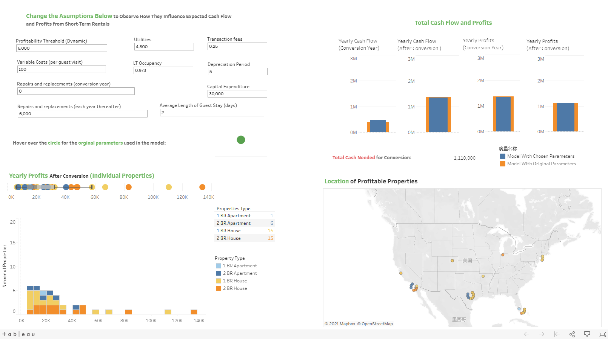

# Business-Consulting-Project
> The project uses data analysis to recommend a real estate management company, Watershed Property Management, to enter the short-term rental market like Airbnb.

## Company Overview
* Watershed is responsible for managing thousands of residential rental properties throughout the United States. 
* It manages several thousand properties in more than 60 different neighborhoods around the United States. The overall property occupancy rates at a very attractive 97.3%.
* Like most traditional property managers, Watershed has thus far exclusively managed long-term leases that typically require tenants to live in a property for a year or more, and pay monthly rent. However, the real estate business has begun extending into a different market: short-term rentals. Short-term tenants, or "guests," pay rent by the night rather than by the month, and are located and communicated with through increasingly popular websites like Airbnb. The project manager would like to know whether Watershed should expand into this short-term rental market.
* Watershed currently has a time-sensitive opportunity to explore the short-term rental market with one of its top property owners, who has expressed interest in working with Watershed to convert some of its long-term rental properties to short-term rental properties.

## Work Flow
1. Elicit information about important variables relevant to the analysis;
2. Draw upon MySQL database skills to extract relevant data from a real estate database;
3. Implement data analysis in Excel to identify the best opportunities for Watershed to increase revenue and maximize profits, while managing  any new risks;
4. Create a Tableau dashboard to show Watershed executive the results of a sensitivity analysis; 
5. Articulate a significant and innovative business process change for Watershed based on the data analysis, that the project recommends to company executives.

## Dashboard
The visualization of the sensitivity analysis:

The link:
[Dashboard](https://public.tableau.com/profile/tingrui.feng#!/vizhome/IncreasingRealEstateManagementProfits_16114619798780/Dashboard1)

## Recommendation

**I recommend that Watershed should take the opportunity to enter the short term rental market with its client.**

* The analysis that serves as the basis of my recommendation indicates that Watershed and its client would benefit from:
    + $1373212 of increased profits during the first year, 
    + yearly profits of $1127212every year thereafter if my recommendation is enacted.  
    + The initial capital investment needed to implement my recommendation would be $1110000.   
* This analysis is based on financial assumptions that were confirmed by company and industry experts, but sensitivity analyses indicate that Watershed should enter the short-term rental market with their client, even if these initial assumptions need to be revised.  

